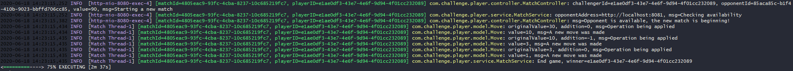

# Player - Game of Three

## Build and Testing
```
└── player
    Build command: ./gradlew build
```

## Running

```
└── player 1
    To start use: SERVER_PORT=8080 ./gradlew bootRun
    
└── player 2
    To start use: SERVER_PORT=8081 ./gradlew bootRun
```

## Consuming APIs

You can try API importing the following Postman collection by here:

[](https://app.getpostman.com/run-collection/ef3a13cc0fb2622f2748)

## Usage
- It needs to have two instances of the Player application, running in different ports.
- After the applications are running choose one to become "Player 1", which will start the game by consuming the API "/match/start".
- The endpoint "/match/start" will return a Match that was created for both players can play.
- The match will continue without making the user wait for the response, so the "match" its asynchronous.
- The idea is to follow the match on the console. There will have the ID of the players, the match information, and the values from the moves made by the players. 
- And once hits value 1, will display the winner on the console of the Player that initiated the match.
- It is possible to play more than one match, but cannot pass the limit defined in the ExecutorService.

See an example of how the match is displayed on the console:



